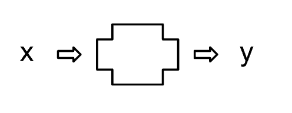
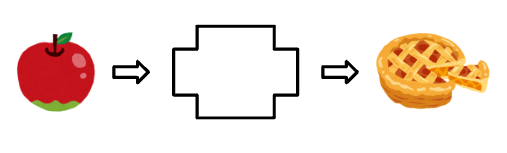

# はじめに
　本資料は中学校数学における関数をとりあげ、一次関数ならびに二次関数を重点的に解説する。これらの分野は中学校数学の指導の中でも説明が難しく、理解が困難であると感じられる生徒が多くいる。中学生向けに解説した資料であるが、指導する先生方にも読んでいただけるような内容を目指して作成する。

## 関数

### 定義

　関数とはどのようなものであるのかこの節で述べる。中学校において関数の定義とは以下である。

\begin{definition}
$y$が$x$の関数であるとは、$x$の値を決めると$y$の値が対応して\textbf{ただ1つに決まる}ことである。
\end{definition}

　関数とはなんなのだろうか。上の定義をもとに考えてみると、$x$と$y$の対応を考えているものが関数である。@fig-function は関数をイメージに起こしたもので、この図において左側を入力、右側を出力とする。すると$x$は入力にあたり、箱を通って$y$として出力されている。関数だと言えそうなものを具体的に考えてみる。@fig-function1 をみると、入力の方にはリンゴがあり箱を通ってアップルパイとして出力されている。それ以外には何も出力されていない。なので$x$がリンゴだと決まったとき$y$はアップルパイとしてただ一つに決まっているので関数と言えそうである。

:::: {.columns}

::: {.column width="50%"}
{#fig-function fig-cap="関数のイメージ" width="70%"}
:::

::: {.column width="50%"}
{#fig-function1 fig-cap="具体的なイメージ" width="70%"}
:::

::::

　先の2つのイメージではどちらも入力に対して何か操作をされて出力されていたと考えられる。操作していた部分は箱であり、我々はこの箱の中身を観察することはできない。しかし、箱によって何か操作されているということはこの2つのイメージを見れば明らかだろう。結論を言うとこの箱の部分が**関数**にあたる。

　中学校の定義ではこの箱の部分を捉えることは難しい。なので2つの図から関数がどのようなものであるかを説明した。実際、「関数」は常用漢字であり昔は「函数」と表記していた。この「函」は箱という意味を持ち、言葉からも関数が何か操作を加える箱であることは想像できる。

　高校数学では、関数を$f$という記号で表し、$x$に対して$f$が定める値を$f(x)$と表す。したがって、$y=f(x)$は「関数$f$に$x$を入力すると、$y$が出力される」ということを表している。

　ただし、この2つのイメージだけで関数を説明するときには注意が必要である。この図では、入力されたものに対して箱の中で何らかの「操作」を加え、その結果を出力しているように見える。しかし、関数は必ずしも具体的な操作や計算を伴うものではない。重要なのは、入力に対して出力がただ1つ対応していることである。

### 変域

　先ほど$x$と$y$を用いて関数を定義した。この$x$と$y$は特定の値を常にとるわけではない。$x$については$2$や$5$のような数字かもしれないし、例のようなリンゴといった食べ物を取るかもしれない。このように、特定の値に固定されず、さまざまな値をとりうる文字を変数と呼ぶ。そして、その$x$に対して、何かしらの規則によって対応した$y$が出力され、$y$は$x$がとる値によって変化するかもしれないし、同じ値を取るかもしれない。このような対応関係にある文字について$x$は**独立変数**、$y$は**従属変数**と呼ぶ。もちろん$y$は$x$によって取りうる値が変わる可能性があるので、$y$も変数である。注意されたいのは、関数では1つの入力に対して2つ以上の出力を持つことはないということである。例えば、ある$x$に対して$y = 2$と$y = 3$の両方が対応するなら、それは関数とはいえない。一方で、異なる入力が同じ出力を持つことは問題ない。このように、1つの入力に対して対応する出力がただ1つに定まることを**一意性**という。
　変数$x$はどんな値でも取れるのだろうか。$x$について何も条件をつけない場合、無限に多くの値をとることができる。そこで、$x$が取れる範囲を限定してみる。この範囲のことを**変域**という。特に関数について、入力にあたる変数が取りうる範囲を**定義域**、出力にあたる変数が取りうる範囲を**値域**と呼ぶ。$x$と$y$で表された関数については、$x$が取りうる値の範囲が定義域で、$y$が取りうる値の範囲が値域である。
　普通、関数については定義域に基づいた値域を考えるため、与えられた$x$について$y$を求めるが、我々は問題を作ったり、解いたりする上で$y$となるような$x$をしばしば考える。例えば、

$$
y = 2x + 1  
$$

において$y = 5$となる$x$を考えると、

$$
\begin{aligned}
5 &= 2x + 1 \\
x &= 2
\end{aligned}
$$

と求めることができる。このように、関数は「$x$から$y$を求める」だけでなく、**出力から入力を逆向きに考える**こともできる。