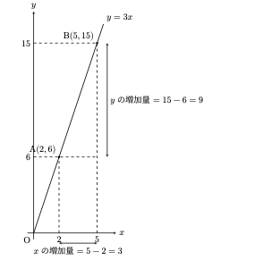

## 一次関数

### 定義

 前節では、関数とは「入力を与えると、ただ1つの出力が返ってくる箱」であることを確認した。本節で扱う**一次関数**は、中学校数学において最も基本的な「箱」の構造を持っている。

 具体的なイメージとして、タクシーの運賃制度を考えてみよう。乗車した瞬間に発生する初乗り運賃が $500$ 円、走行距離が $1\text{ km}$ 増えるごとに加算される運賃が $300$ 円であるとする。走行距離を $x\text{ km}$、支払う運賃を $y\text{ 円}$ とおくと、両者の関係は次のように表される。

$$
y = 300x + 500
$$

 このように、入力 $x$ に比例する値（$300x$）に、一定の基準となる値（$500$）を足し合わせた値を出力する関数が一次関数である。数学的には次のように定義される。

\begin{definition}
$y$が$x$の一次関数であるとは、$a, b$を定数（ただし $a \neq 0$）として、
$$y = ax + b$$
という形で表される関係のことである。
\end{definition}

 ここで $b = 0$ の場合を考えると $y = ax$ となり、小学校や中学校第1学年で学習した**比例**の式と一致する。すなわち、比例とは一次関数において「$b$ が $0$ である特別な場合」に過ぎない。

### 増加量

　ここでは、**増加量**について解説する。増加量は難しく考える必要はない。言葉通り、**ある値がどれだけ変化したのか**を表すものである。例えば、$x$ が $2$ から $5$ まで変化したとする。このとき、$x$ の増加量は $5-2=3$ である。つまり、$x$ はもとの値である $2$ から $3$ だけ増えて $5$ になったので、増加量は $3$ である。別の例として、$x$ が $-9$ から $3$ まで変化した場合を考えてみよう。このとき、$3-(-9)=12$ となるので、$x$ の増加量は $12$ である。

　このように、増加量とは、**ある値から別の値へ変化したとき、どれだけ変化したのかを表す量**である。そして、増加量は 

$$
\text{増加量}=\text{変化した後の値}-\text{変化する前の値}
$$
 
によって求めることができる。

　注意されたいのは、**増加量は必ずしも正の数になるとは限らない**ということである。例えば、$x$ が $5$ から $2$ に変化した場合、$2-5=-3$ となる。この場合、実際には $x$ は $3$ 減少している。しかし、数学では「変化する前の値」と「変化した後の値」を決めて、その順番にしたがって計算するため、増加量は $-3$ となる。

　関数の場合について考えてみる。例として、$x$ と $y$ の一次関数 $y=3x$ を考える。$x$ が $2$ から $5$ まで変化したとき、$y$ はどのように変化するだろうか。関数の式が与えられているので、それぞれの $x$ に対応する $y$ の値を求めることができる。$x=2$ のとき、$y=3\times2=6$ であり、$x=5$ のとき、$y=3\times5=15$ である。したがって、$x$ が $2$ から $5$ まで変化すると、$y$ は $6$ から $15$ まで変化する。このときの $y$ の増加量は、$15-6=9$ となる。

　重要なのは、$x$ の「変化する前の値」と「変化した後の値」に、それぞれ対応する $y$ の値があるということである。つまり、$x=2$ のときは $y=6$、$x=5$ のときは $y=15$ というように対応している。この対応関係を意識することが、関数における増加量を考えるうえで重要である。@fig-amount は、この関係を図で表したものである。

{#fig-amount fig-cap="$y = 3x$における$x$と$y$の増加量"}

　$a$ が負の場合も考えてみる。一次関数 $y=-2x$ について、$x$ が $-6$ から $2$ まで変化したとする。このとき、$x=-6$ では $y=-2\times(-6)=12$ であり、$x=2$ では $y=-2\times2=-4$ となる。したがって、$x$ が $-6$ から $2$ まで変化すると、$y$ は $12$ から $-4$ まで**変化する**。このときの $y$ の増加量は、$-4-12=-16$ である。

　ここで、実際には $y$ が $12$ から $-4$ へ**減少しているにもかかわらず、増加量が $-16$ となる**ことに注意されたい。「減少しているのだから増加量ではない」と考えてはいけない。数学では、変化する前の値と変化した後の値を決め、その順番にしたがって、$\text{増加量}=\text{後の値}-\text{前の値}$ と計算する。したがって、この場合は $-4-12=-16$ が正しい。$12-(-4)=16$ と計算してはいけない。これは、変化の向きを逆にしてしまっているからである。

　このことは、グラフ上で矢印をイメージすると分かりやすい。@fig-arrow が矢印を書いた図で、矢印の**根元が変化する前の値**、矢印の**先が変化した後の値**であると考えればよい。そして、増加量は $\text{矢印の先の値}-\text{矢印の根元の値}$ によって求められる。

{#fig-arrow fig-cap="増加量のイメージ"}

　このように、増加量を考えるときには、単に「増えたか、減ったか」を見るのではなく、**どこからどこへ変化したのか**を意識することが重要である。

### 変化の割合と傾き

 一次関数 $y = ax + b$ を特徴づける最も重要な要素は、$x$ の係数である定数 $a$ である。この $a$ は、代数的な視点と幾何的な視点で説明できる。

#### 代数的な意味：変化の割合

 $x$ の増加量に対する $y$ の増加量の割合を**変化の割合**と呼ぶ。

$$
\text{変化の割合} = \frac{y\text{の増加量}}{x\text{の増加量}}
$$

 一次関数における決定的な特徴は、**$x$の増加量によらず、変化の割合が常に一定であり、その値は$a$に等しい**という点である。

#### 幾何的な意味：傾き
 
 　一次関数の関係を$xy$座標平面上に描くと、そのグラフは必ず**直線**になる。$x$ の値を $1$ 増やすごとに$y$の値は常に$a$だけ変化するため、点をつなぐと「一定の傾きをもつ直線」が現れるのである。

 この直線の傾きと向きを表す数値こそが $a$ であり、グラフの世界では $a$ を直線の**傾き**と呼ぶ。

* **$a > 0$** のとき：右上がりの直線（$x$ が増えると $y$ も増える）
* **$a < 0$** のとき：右下がりの直線（$x$ が増えると $y$ は減る）

注意されたいのは、代数的意味の変化の割合と幾何的意味の傾きである$a$は同じものであるということである。
つまり以下の式でまとめられる。

$$
\text{変化の割合} = \text{傾き} = a
$$

　以下の @fig-sloped がその概要である。

{#fig-sloped fig-cap="傾き$a$の符号による直線の向きの違い"}

### 切片

 もう一つの定数 $b$ について考える。$x = 0$ を代入すると $y = a \times 0 + b = b$ となるため、一次関数のグラフは必ず点 $(0, b)$ を通る。

 この点 $(0, b)$ は、直線が $y$ 軸と交わる位置を示している。この $b$（または交点そのもの）を**$y$切片**（または単に**切片**）と呼ぶ。タクシーの例で言えば、移動距離が $0\text{ km}$ の時点で発生している初乗り運賃（$500$ 円）に相当する部分である。

* **傾き $a$**：直線の傾き具合（右に $1$ 進んだときの $y$ の変化量）
* **切片 $b$**：$y$ 軸上の交点（$x=0$ のときのアウトプット）

 この $a$ と $b$ の役割を理解すれば、式からグラフを描くことも、逆にグラフから式を読み取ることも容易になる。

### 方程式との関係

 前節で触れた「出力 $y$ から入力 $x$ を逆算する」という操作は、中学校数学で扱う**方程式の解法**そのものである。

 例えば、一次関数 $y = 2x + 1$ において、出力が $y = 5$ となるような入力 $x$ を探す状況を考える。

$$
2x + 1 = 5
$$

 この式は、まさしく一次方程式である。これを解くと $x = 2$ が得られる。

 つまり、**方程式を解くという作業は、「関数の出力を特定の値に固定したとき、それに対応する入力を特定する操作」**と解釈できる。このように捉えると、「関数」と「方程式」は独立した単元ではなく、同じ対応関係を表から見ているか裏から見ているかの違いであることが理解できる。
