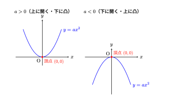
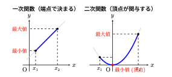

## 二次関数

### 定義

 前節の一次関数では、$x$ が増えるにつれて $y$ も一定の割合で変化する関係（直線）を扱った。しかし、現実世界や自然現象の中には、変化のスピードが加速していくような関係も数多く存在する。

 具体的なイメージとして、ボールを高いところから静かに落としたときの「落下のようす」を考えてみよう。ボールは落ち始めてから時間が経つほどスピードが増していく。時間を $x\text{ 秒}$、落下した距離を $y\text{ m}$ とすると、$1\text{ 秒}$ 後には約 $5\text{ m}$、 $2\text{ 秒}$ 後には約 $20\text{ m}$、$3\text{ 秒}$ 後には約 $45\text{ m}$ 落下する。

 この関係を式に表すと、およそ次のようになる。

$$
y = 5x^2
$$

 このように、出力 $y$ が入力 $x$ の $2$ 乗に比例して大きくなる関数を、中学校数学では**$x$ の $2$ 乗に比例する関数**（高校数学でのいわゆる二次関数）と呼び、次のように定義する。

\begin{definition}
$y$が$x$の二次関数（$x$の$2$乗に比例する関数）であるとは、$a$を $0$ でない定数として、
$$y = ax^2$$
という形で表される関係のことである。
\end{definition}

### 変化の割合

 一次関数では、変化の割合は常に一定値 $a$ であった。しかし、二次関数 $y=ax^2$ においては、**どこからどこまで変化させるかによって変化の割合が変化する**という大きな違いがある。

 具体例として、$y = x^2$ において $x$ の値を変化させてみよう。

1. **$x$ が $1$ から $3$ まで変化するとき**
   * $x = 1$ のとき $y = 1^2 = 1$
   * $x = 3$ のとき $y = 3^2 = 9$
   * $x$ の増加量 $= 3 - 1 = 2$
   * $y$ の増加量 $= 9 - 1 = 8$
   $$\text{変化の割合} = \frac{8}{2} = 4$$

2. **$x$ が $3$ から $5$ まで変化するとき**
   * $x = 3$ のとき $y = 9$
   * $x = 5$ のとき $y = 5^2 = 25$
   * $x$ の増加量 $= 5 - 3 = 2$
   * $y$ の増加量 $= 25 - 9 = 16$
   $$\text{変化の割合} = \frac{16}{2} = 8$$

 同じ「$x$ が $2$ 増える」という変化であっても、$x$ の値が大きくなるにつれて $y$ の増加量は跳ね上がり、変化の割合も $4 \to 8$ と大きくなっていることが分かる。

 一般に、$y = ax^2$ において $x$ が $p$ から $q$ まで変化するとき、変化の割合は次のような簡潔な式で表すことができる。

$$
\text{変化の割合} = \frac{aq^2 - ap^2}{q - p} = \frac{a(q - p)(q + p)}{q - p} = a(p + q)
$$

上の式は一般的にかけるというだけで覚える必要はない。むしろ、一次関数の変化の割合が完璧に理解できていれば二次関数における変化の割合もすぐに理解できるだろうし、しっかり考えればどこからどこへの増加であろうと導出できるのである。

### グラフと幾何的特徴

 二次関数 $y = ax^2$ の関係を $xy$ 座標平面上に描くと、そのグラフは直線ではなく曲線になる。物を投げたときに描く軌跡に似ていることから、この曲線を**放物線**（ほうぶつせん）と呼ぶ。

### 放物線の主な性質

* **$y$ 軸に関して線対称**：$x = 2$ のときも $x = -2$ のときも、$y$ の値は同じ $4a$ になる。そのため、$y$ 軸を折り目にして折ると左右がピッタリ重なる。
* **頂点と軸**：対称の軸（$y$ 軸）と放物線が交わる点を**頂点**と呼ぶ。$y = ax^2$ のグラフの頂点は常に**原点 $(0, 0)$** である。
* **$a$ の符号による向き**
  * **$a > 0$** のとき：上に開いた曲線（下に凸）。原点で最も低い位置をとる。
  * **$a < 0$** のとき：下に開いた曲線（上に凸）。原点で最も高い位置をとる。

 以下の @fig-graph は、$a > 0$ と $a < 0$ における放物線の概形を示したものである。

{#fig-graph fig-cap="二次関数$y = ax^2$のグラフの概形" width=80%}

### 関数の最大値・最小値

　最後に、関数の最大値と最小値について取り上げる。関数における最大値および最小値とは、基本的には、関数がとる値のうち最も大きい値および最も小さい値、すなわち$y$の値のことである。では、関数の最大値と最小値は何によって決まるのであろうか。

　関数について説明した節では、**定義域**と**値域**について述べた。関数では、定義域に含まれる$x$の値が決まると、それに対応する$y$の値が定まる。そのため、$x$は**独立変数**、$x$に対応して値が定まる$y$は**従属変数**と呼ばれる。

　最大値と最小値は$y$の値であるが、その$y$の値は、どのような$x$の値を考えるかによって変化する。したがって、関数の最大値と最小値を考える際には、**定義域、すなわち独立変数$x$がとる範囲が重要になる**。同じ関数であっても、定義域が異なれば、最大値や最小値が異なる場合がある。

　以下では、一次関数と二次関数を例に挙げ、定義域によって最大値と最小値がどのように決まるのかを考えてみる。

#### 1. 一次関数における最大値・最小値

 一次関数 $y = ax + b$ （$a \neq 0$）はグラフが一直線であり、途中で曲がることがない。したがって、定義域（$x$ の変域）が制限されている場合、$y$ が最大・最小となるのは**必ず定義域の両端**である。

* **$a > 0$のとき**
  * $x$ が最も小さい端点で **最小値**
  * $x$ が最も大きい端点で **最大値**
* **$a < 0$のとき**
  * $x$ が最も小さい端点で **最大値**
  * $x$ が最も大きい端点で **最小値**

 このように、一次関数では「どの $x$ のときに $y$ が最大・最小になるか」が定義域の端点のみによって単純に決定される。

#### 2. 二次関数における最大値・最小値

 一方、二次関数 $y = ax^2$ （$a \neq 0$）は放物線を描き、原点 $(0, 0)$ で折り返す構造を持っている。そのため、最大値・最小値を決定する際には、**「定義域の中に頂点（原点）が含まれているかどうか」**が決定的な違いを生む。

* **定義域が原点を含まない場合**
  * 一次関数と同様に、定義域の両端の $x$ によって最大値・最小値が決まる。
* **定義域が原点を含む場合**
  * グラフが頂点を通るため、端点だけを見ていると誤った答えを導いてしまう。
  * $a > 0$（下に凸）ならば、原点 $x = 0$ のとき **最小値 $0$** をとり、原点から遠い方の端点 $x = 2$ で **最大値** をとる。

### まとめ

 このように、最大値や最小値は、単に $y$ だけを見て決まるのではなく、**「独立変数 $x$ がどの範囲を動き、その中でグラフがどのような挙動をとるか」**によって決定される。

 @fig-max は、一次関数と二次関数において独立変数 $x$ の動きがどのように最大値・最小値を引き起こすかを示した比較図である。

{#fig-max fig-cap="一次関数と二次関数における最大値・最小値の決まり方" width=80%}